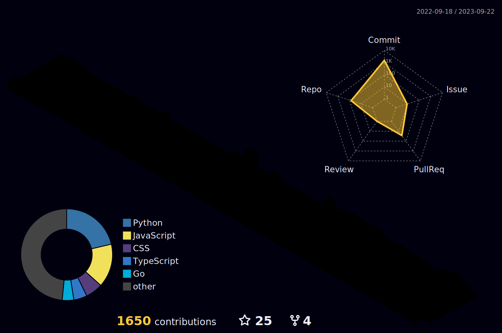

## Hi there 👋

<!--
**Abson-dev/Abson-dev** is a ✨ _special_ ✨ repository because its `README.md` (this file) appears on your GitHub profile.

Here are some ideas to get you started:

- 🔭 I’m currently working on ...
- 🌱 I’m currently learning ...
- 👯 I’m looking to collaborate on ...
- 🤔 I’m looking for help with ...
- 💬 Ask me about ...
- 📫 How to reach me: ...
- 😄 Pronouns: ...
- ⚡ Fun fact: ...
-->

<h2>GitHub Analytics
 </h2>

  

 
	

 
<h2 >🏆 GitHub Profile Trophy</h2>

 
  Views 
  

## ⚡️GitHub Contributions
	
<h4 align="center">Isometric view of contributions in the last year</h4>

	

## 🚀GitHub Metrics

	

